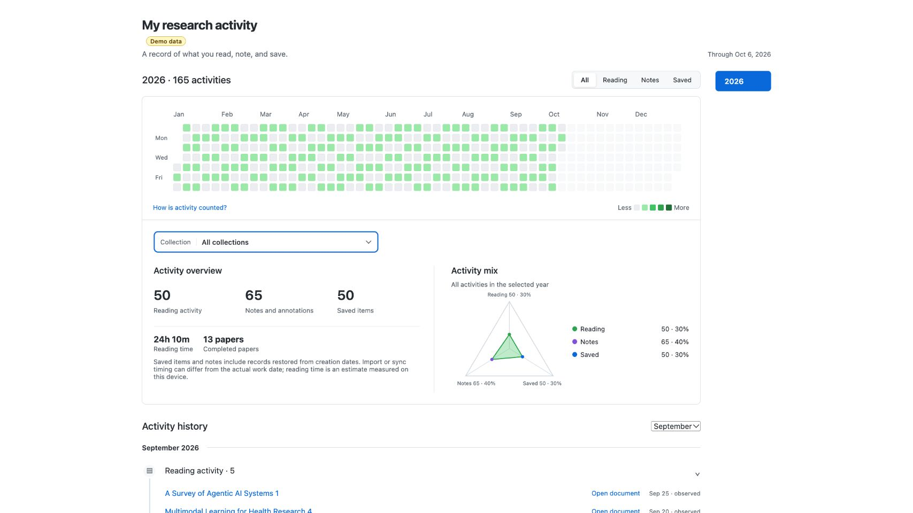
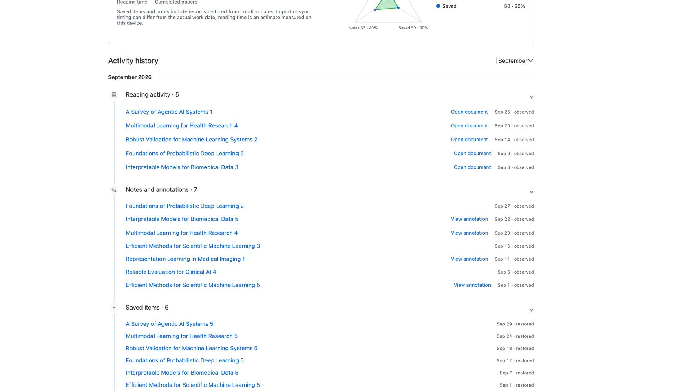
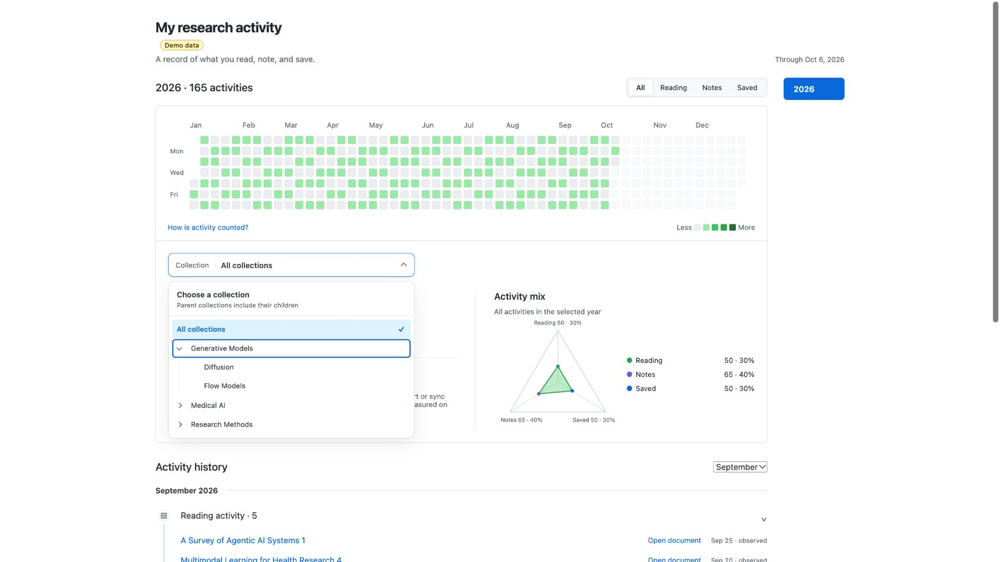

# Zotero Research Activity · v0.2.3

**A private, GitHub-style activity page for your Zotero library.**

Zotero Research Activity brings reading, notes, annotations, saved papers, and completed papers into one Zotero tab. It is a fork of [Zotero Read Tracker](https://github.com/marysethomas/zotero-read-tracker), extended for a personal research workflow.



The screenshots use synthetic demo data, including fictional collections and paper titles. This plugin does not upload your library or activity records.

## Install

1. Download the `.xpi` from the [latest release](https://github.com/KimYeongHyeon/zotero-read-tracker/releases/latest).
2. In Zotero, open **Tools → Plugins**.
3. Select the gear menu, then **Install Plugin From File…**.
4. Choose the downloaded `.xpi`.
5. Open **Tools → Research Activity**.

The activity page opens inside Zotero. Reopening it selects the existing tab.

## What it shows

- A year-long activity calendar with **All**, **Reading**, **Notes**, and **Saved** filters.
- Year filters and a collapsed, hierarchical collection picker. Expand parent collections to select a nested collection. A collection includes its current child collections; an item in more than one matching collection is counted once.
- Reading, note, and saved-paper totals, measured reading time, completed-paper count, and a triangular activity-ratio view.
- A date and month activity timeline. Select a paper to reveal it in the library, open a PDF, or jump to an annotation.
- A persistent view state, so the selected year, collection, activity filter, and month return after restart.



## Collection navigation

The picker starts collapsed. Use the arrow to expand a parent, or click its name to select the whole branch. Choosing a collection closes the menu and shows its full path. The menu has consistent rows, a selected checkmark, a bounded scroll area, and keyboard support.



## How activity is counted

| Activity | Counted when |
| --- | --- |
| **Reading** | A paper receives at least 60 seconds of accumulated active reading in Zotero’s built-in PDF reader on one local day. Only foreground activity within 120 seconds of document input is counted; inactive windows and timer gaps longer than 10 seconds are excluded. |
| **Notes** | A note or annotation, including a highlight, is created. Editing an existing note or annotation does not create another activity. |
| **Saved** | A top-level library item is added. Attachments such as PDFs are not counted separately. |
| **Completed** | The existing Read Tracker manual read status is enabled. It remains separate from automatic reading activity. |

On first run, the plugin restores saved-paper, note, annotation, and completed-paper dates from Zotero item metadata and the existing read-status fields. Import and sync history can make an item’s creation date differ from the day you actually worked on it. The plugin does **not** infer historical reading time or historical reading days.

## Privacy and storage

This release is for **your personal library on the current computer**. It does not track group-library members, sync reading time across devices, or publish any activity to the web.

The plugin stores its local activity state in `research-activity.json` inside Zotero’s data directory. Writes use a temporary file and replacement step. It does not change Zotero’s database schema or paper contents; the existing manual completion status continues to use the item’s `Extra` field.

Items currently in the trash, and their children, are excluded. Restoring a library item returns its activity to the view. Collection filtering always follows the item’s current library membership.

## Compatibility

Tested with **Zotero 10.0.5 on macOS**. Other Zotero versions and operating systems are not claimed as supported.

The activity collector uses Zotero Reader and tab internals that are not a stable public plugin API. Re-test the plugin after upgrading Zotero.

See the [validation report](VALIDATION.md) for tested behavior and remaining limits.

## Develop

```sh
node tests/activityModel.test.cjs
node tests/activityView.test.cjs
python3 scripts/package.py dist/ZoteroResearchActivity.xpi
```

The first two commands run the model and view checks. The packaging command creates a dependency-free XPI from an explicit runtime-file allowlist.

## Credits and license

This project is based on [Zotero Read Tracker](https://github.com/marysethomas/zotero-read-tracker) by marysethomas. It is released under the [MIT License](LICENSE).
