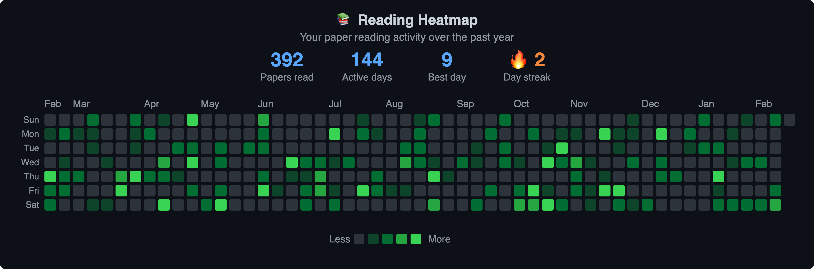
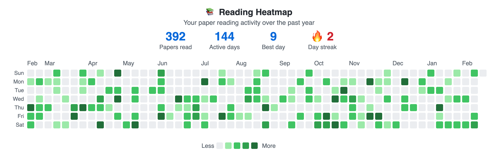

# ZoteroReadTracker
A Zotero plugin to track your reading activity and visualize it with a GitHub-style heatmap calendar


---

### Also see these projects for tracking reading activity
- [zotero-reading-list](https://github.com/Dominic-DallOsto/zotero-reading-list) - Track reading status with labels such as To Read, In Progress, or Read
- [zotero-paper-tracker](https://github.com/pranavponnusamy/zotero-paper-tracker) - A web app that marks read papers with strikethrough
- [zotero-action-tags](https://github.com/windingwind/zotero-actions-tags) - Tag papers as read/unread and customize actions to be triggered
- [zotero-style](https://github.com/MuiseDestiny/zotero-style) - Unread papers are shown in bold until marked as read

---

## Screenshots

### Dark Mode


### Light Mode


---

## Installation

### From Release

1. Download the latest `.xpi` file from [Releases](https://github.com/marysethomas/zotero-read-tracker/releases)
2. Open Zotero
3. Go to `Tools` → `Plugins`
4. Click the gear icon ⚙️ and select `Install Plugin From File...`
5. Select the downloaded `.xpi` file
6. Restart Zotero to ensure proper plugin functionality

### From Source

1. Clone this repository
2. Zip the contents (not the folder itself) into a `.xpi` file

```bash
# Zip contents into .xpi
zip -r ../ZoteroReadTracker.xpi manifest.json bootstrap.js readTracker.js heatmapBuilder.js
```

3. Follow steps 2-6 above

### Compatibility

- **Zotero 7.0+**

---

## Usage

### Toggle Read Status

1. Right-click on any item in your library
2. Select **"Toggle Read Status"**
3. The item will be marked with a checkmark in the **Read Status** column (or unmarked if already read)
4. Highlight multiple items to toggle read status simultaneously
5. Make **Read Status** column visible by right-clicking on the column headers and selecting **Read Status**

### Plot Reading Heatmap

1. Go to `Tools` → **"Plot Reading Heatmap"**
2. Zotero will prompt you to select a browser (e.g. Chrome)
3. The browser window will open with your heatmap
4. Use the 🌙 button to switch between dark and light themes
5. Hover over cells to see paper counts and dates
6. Export using the buttons at the bottom:
   - 📋 **Copy SVG** — Copy to clipboard
   - 💾 **Save SVG File** — Download as SVG
   - 🖼 **Save PNG** — Download as PNG
   - 📤 **Save Shareable HTML** — Download as HTML file

### View and Edit Read Details

Read status is stored in each item's **Extra** field using the following format:

```bash
Read: true
Read-Date: YYYY-MM-DD
Read-Time: HH:MM:SS
```

If the item's read status is toggled off, the read status will be updated to the following:

```bash
Read: false
```

The read date and time can be manually edited if needed:

1. Select the item in your library
2. Open the **Info** panel (right sidebar)
3. Find the **Extra** field
4. Edit the `Read-Date: YYYY-MM-DD` or `Read-Time: HH:MM:DD` line

### Generate example plots

To preview the heatmap with example data:

1. Open Zotero
2. Go to `Tools` → `Developer` → `Run JavaScript`
3. Copy and paste the contents of `plotExampleHeatmap.js` into the Code box
4. Click **Run**

---

## Acknowledgments

Inspired by GitHub's contribution graph